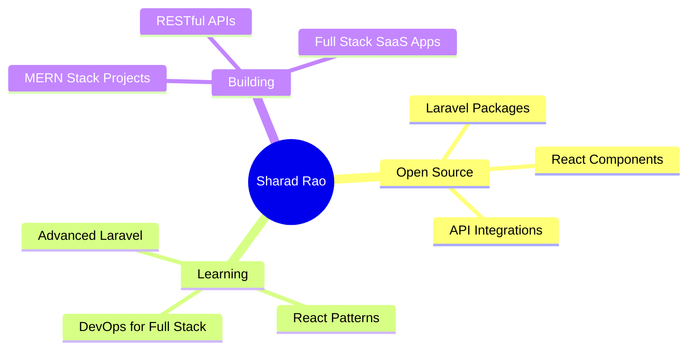

# Hi there, I'm Sharad Rao! 👋

<div align="center">
  
</div>

<div align="center">
  
  
</div>

---

## 🚀 About Me

```javascript
const sharadRao = {
    pronouns: "He/Him",
    location: "India 🇮🇳",
    role: "Full Stack Developer",
    languages: ["PHP", "JavaScript", "TypeScript", "C++"],
    specialties: ["Laravel", "React", "Node.js", "Web Development", "API Integration"],
    currentFocus: "Advanced Laravel + MERN stack apps",
    funFact: "I believe in improving both frontend and backend! 🎯",
    openToWork: true
};
```

<div align="center">
  
</div>

---

## 🛠️ Tech Arsenal

<div align="center">

### 💻 Programming Languages
<p>
  
  
  
  
</p>

### 🚀 Frameworks & Libraries
<p>
  
  
  
  
  
</p>

### 🗄️ Databases
<p>
  
  
  
  
</p>

### 🎨 Frontend Technologies
<p>
  
  
  
  
  
</p>

### 🔧 Tools & Platforms
<p>
  
  
  
  
  
</p>

</div>

---

## 📊 GitHub Analytics

<div align="center">
  
  
</div>

<div align="center">
  
</div>

<div align="center">
  
</div>

---

## 🏆 GitHub Trophies

<div align="center">
  
</div>

---

## 🎯 Current Focus

<div align="center">



</div>

### 🔥 What I'm Up To

- 🌱 Currently mastering **Advanced Laravel & React Patterns**
- 👯 Looking to collaborate on **Open Source Projects**
- 🤝 Open to **Full-time opportunities** and **Freelance work**
- 💡 Working on **AI-powered web applications**
- 📚 Learning **Cloud Architecture** and **DevOps practices**

---

## 🌐 Let's Connect!

<div align="center">

[](https://sharad4.netlify.app)
[](https://linkedin.com/in/sharad4)
[](mailto:sharad011989@gmail.com)
[](https://leetcode.com/code_rao)
[](https://kaggle.com/sharadrao)

</div>

---

## 💼 Professional Experience

<div align="center">

| 🏢 Role | 🛠️ Technologies | 🎯 Focus |
|---------|------------------|----------|
| **Full Stack Developer** | PHP, Laravel, CodeIgniter, React | Web Applications |
| **Nodejs Developer** | Express, MongoDB | Backend & Data |
| **Frontend Developer** | JavaScript, React, CSS | User Interfaces |
</div>

---

<!---## 📈 Contribution Activity

<div align="center">
  
</div>--->

---

## 💭 Random Dev Quote

<div align="center">
  
</div>

---

<div align="center">
  
</div>

<div align="center">
  <h3>⭐️ From <a href="https://github.com/sharad4">sharad4</a> with ❤️</h3>
  <p><em>Happy Coding! 🚀</em></p>
</div>
